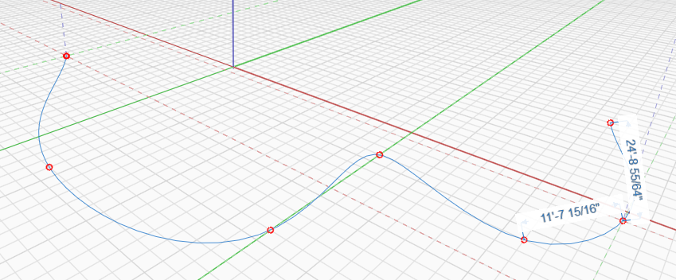
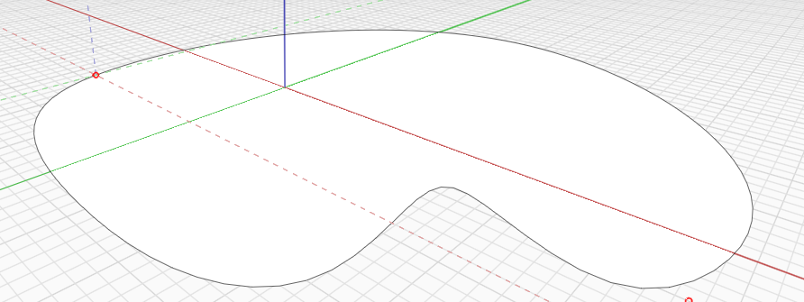

# Spline

The Spline tool allows you to create organic sketches in space or on other objects.

A spline is drawn from at least 3 interpolated points. The connected geometry is simplified creating a smooth and organic curve between the specified points. Like other drawing tools, splines can be drawn in 3D by snapping to 3D points while drawing.

To specify a distance, start typing a dimension value, and hit OK or press Enter in the Edit Dimension dialog.

 Splines can also close on themselves creating a face.

