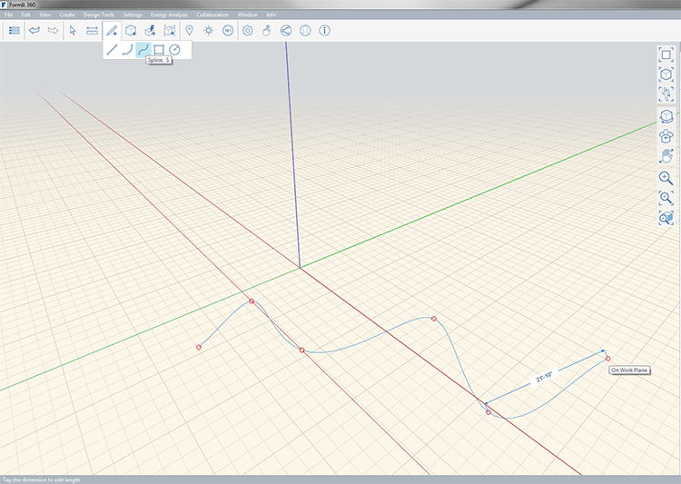
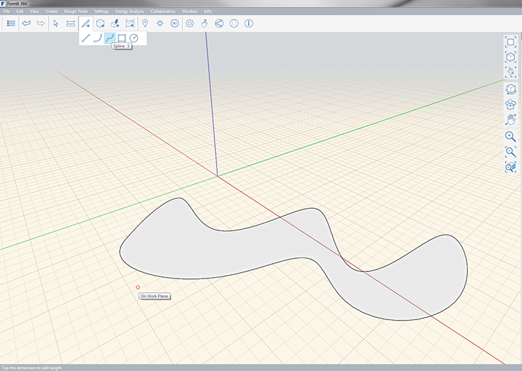

# Spline Tool

Spline tool allows you to create organic sketches in space or on other objects.

Keyboard: S

A spline is drawn from at least 3 interpolated points. The connected geometry in simplified creating a smooth and organic curve between the specified points. Like other drawing tools, splines can be drawn in 3D by snapping to 3D points while drawing.

You can see the length of the line as you draw; to manually specify a length press **tab**. Splines can also close on themselves creating a face.

