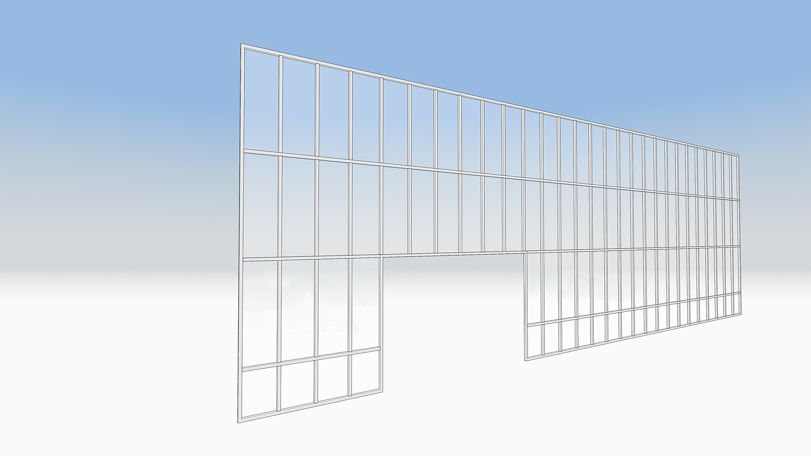
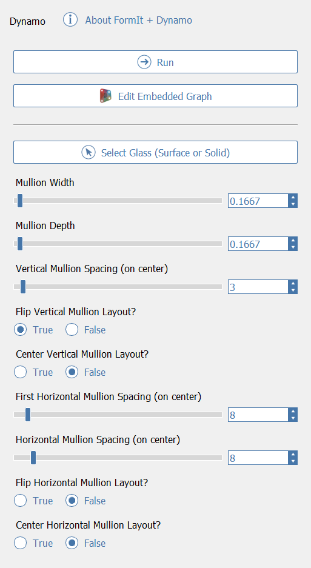
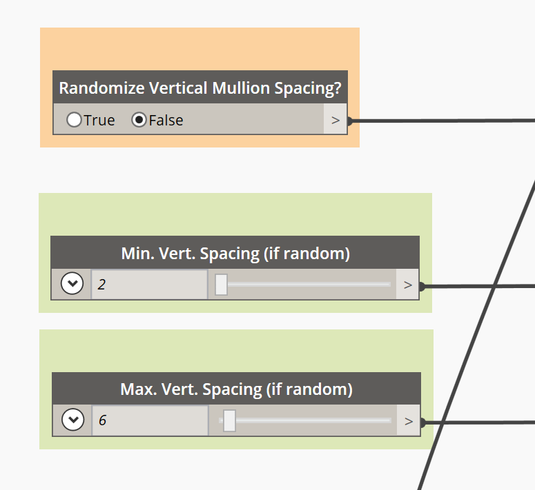
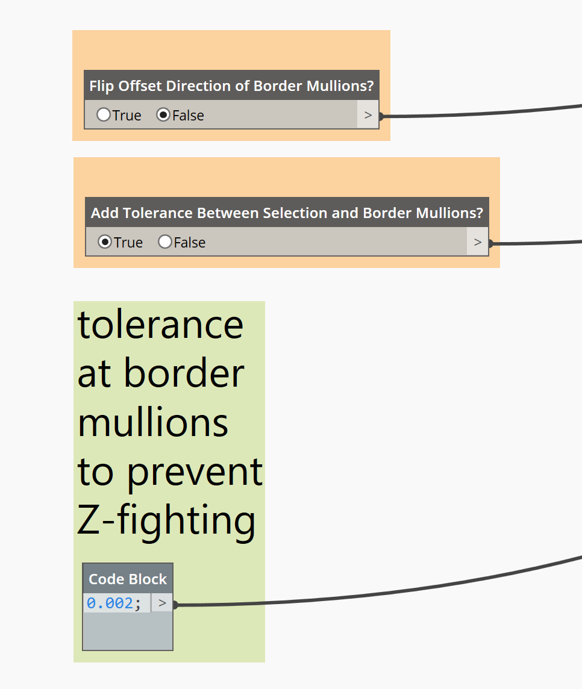

# Sistema de montantes de escaparate/muro cortina

## Con tecnología de Dynamo

Dynamo proporciona la capacidad de crear rápidamente sistemas de montantes de muro cortina/escaparate en FormIt. Puede encontrar el sistema de muro cortina/escaparate en el directorio de muestras de Dynamo del panel de Dynamo:

## Selección de "cristal" para el sistema de montantes

A partir de FormIt 2021.2, el sistema de muro cortina/escaparate utiliza el nuevo nodo [SelectFromFormIt](https://formit.autodesk.com/page/formit-dynamo#dynamo-formit-nodes), que permite seleccionar un elemento de "cristal" \(una cara única o un sólido extruido\) alrededor del que generar un sistema de montantes.

Al hacer clic en la miniatura del muro cortina/escaparate \(observe el icono que indica que se requiere una selección\), FormIt le solicitará que seleccione la geometría de cristal para continuar, como se muestra a continuación:

A continuación, se ofrecen algunas notas y advertencias sobre cómo funciona la selección de cristal:

* Actualmente, solo se admiten superficies planas. Si selecciona una serie de superficies \(por ejemplo, una superficie "curva" compuesta de superficies planas más pequeñas\), la secuencia de comandos encontrará la cara plana más grande y la utilizará. 
* Si el cristal es sólido (es decir, una sola cara extruida ligeramente para representar algo de grosor), la secuencia de comandos encontrará la superficie más grande, por lo que los montantes resultantes se generarán en un lado del sólido de cristal.
* Puede dibujar huecos para puertas y eliminar la superficie resultante del contorno de cristal; los montantes resultantes respetarán el hueco de puerta, dejándolo en blanco para la adición de puertas.
* Debido a las limitaciones de Dynamo, esta secuencia de comandos no funcionará si la geometría de cristal tiene huecos en el medio.

## Consejos y trucos

Al seleccionar la geometría de un gráfico de Dynamo en FormIt, algunos trucos organizativos pueden simplificar la experiencia y facilitar la creación de ejemplares de los resultados, como se indica a continuación:

* Coloque el cristal en un grupo y utilice este como selección para la secuencia de comandos de escaparate/muro cortina. De esta forma, es más fácil editar el perfil de cristal después de generar los montantes y, si el cristal se modifica considerablemente entre tramos y los ID de cara han cambiado, el grupo garantiza que la secuencia de comandos siempre encuentre el cristal, ya que utiliza el ID de grupo, no el ID de cara.
* Si tiene previsto copiar y pegar los resultados del sistema de montantes en otras ubicaciones del modelo, es mejor que el cristal y los montantes resultantes se hayan incluido en un grupo. Esto también evitará problemas si el nodo de selección no sabe qué ejemplar de cristal utilizar cuando solo se copie y se pegue el grupo de montantes resultante.
   * Incluya primero el cristal en un grupo. Haga doble clic en él para seleccionar el cristal y pulse G, o bien utilice los comandos de grupo del menú contextual o la barra de herramientas.
   * Seleccione el grupo resultante y colóquelo en otro grupo.
   * Haga doble clic para introducir el primer grupo. Este es el "contenedor" tanto para el cristal como para los montantes resultantes.
   * Haga clic en la miniatura del muro cortina/escaparate y utilice el grupo de cristal como selección.
   * Una vez que se ejecute la secuencia de comandos, puede salir del grupo y copiar y pegar el contenedor según sea necesario. Puede editar cualquiera de los ejemplares \(ajustando la forma o los parámetros de cristal\) sin problemas.

## Opciones del sistema de montantes

Una vez que seleccione un cristal y ejecute la secuencia de comandos, obtendrá un resultado en el lienzo de FormIt en forma de grupo de FormIt. Este grupo se seleccionará automáticamente y el panel Propiedades presentará las opciones disponibles.

* **Ejecutar**: si modifica la forma del cristal y desea volver a ejecutar el gráfico para actualizar los resultados del montante, haga clic en este botón.
* **Editar gráfico incrustado**: edite la secuencia de comandos de Dynamo que genera la geometría. Esta secuencia de comandos está incrustada en el archivo de FormIt y es específica de este grupo.
* **Select Glass \(Surface or Solid\)**: haga clic en esta opción para actualizar la selección a un cristal diferente alrededor del que generar los montantes.

La secuencia de comandos utilizará los valores por defecto para su primera ejecución, por lo que es recomendable que los ajuste a su caso de uso exclusivo. Todos los valores utilizarán las unidades de FormIt actuales.

* **Mullion Width + Mullion Depth**: la anchura y la profundidad de los elementos de montante.
* **Vertical Mullion Spacing**: la distancia, en el centro, entre cada montante vertical.
* **Flip Vertical Mullion Layout**: la secuencia de comandos inicia la separación entre montantes verticales desde un lado, elegido arbitrariamente. Si el resultado inicia la separación entre montantes en el lado incorrecto para el caso de uso, establezca esta opción en "True" para cambiar la presentación para que comience en el sitio opuesto.
* **Center Vertical Mullion Layout**: en lugar de iniciar el cálculo de separación entre montantes verticales en un extremo del cristal, inicie el cálculo en el medio, lo que permite crear un diseño simétrico de montantes verticales.
* **First Horizontal Mullion Spacing** permite establecer la primera separación entre montantes horizontales desde la parte inferior. Resulta útil si necesita una fila de módulos de cristalera más cortos en la parte inferior, separados del resto de la distancia de montantes horizontales.
* **Horizontal Mullion Spacing**: separación típica entre montantes horizontales, en el centro, a partir del primer montante, tal como se ha indicado anteriormente.
* **Flip Horizontal Mullion Layout**: si desea que el diseño de montante horizontal comience en la parte superior en lugar de en la inferior, establezca esta opción en "True".
* **Center Horizontal Mullion Layout**: en lugar de iniciar el cálculo de separación entre montantes horizontales en la parte inferior o superior del cristal, inicie el cálculo en el medio, lo que permite crear un diseño simétrico de montantes horizontales.

## Opciones ocultas

¿Desea un mayor nivel de personalización? Hay varias opciones avanzadas ocultas en el panel Propiedades de FormIt; se puede acceder a ellas haciendo clic en Editar gráfico incrustado para visualizar el contenido completo del gráfico en Dynamo:

### Montantes aleatorios

* **Randomize Vertical and Horizontal Mullion Layout**: establezca esta opción en "True" para separar los montantes verticales u horizontales de forma aleatoria.
* **Min/Max Mullion Spacing \(if random\)**: ajuste estos valores para establecer un intervalo de valores aleatorios de distancia mínima y máxima.

### Montantes de borde

* **Flip Offset Direction of Border Mullions:** por defecto, el sistema de montantes utilizará el contorno de cristal y lo desfasará hacia dentro para crear los montantes de borde. Para desfasar hacia fuera, establezca esta opción en "True". Esto aumentará el tamaño general del sistema de montantes fuera del contorno de cristal mediante la opción "Mullion Width".
* **Tolerance Between Selection and Border Mullions**: por defecto, el sistema de montantes se genera exactamente en el borde del cristal, lo que podría provocar un conflicto de planos en el que chocarían el borde del cristal y las superficies exteriores de los montantes de borde. En la mayoría de los casos, esto no será visible, pero si el caso de uso requiere que los bordes del sistema estén visibles y desea evitar el conflicto de planos, active esta opción y ajuste el valor de tolerancia según sea necesario.

