### Tilt, Array, Copy and Paste

---
> To create more complex designs after sketching a shape or placing a primitive, you can use several contextual tools to modify your geometry. These operations include Tilt, Array, and Copy and Paste.

---

To **tilt a face**, select a face, right-click to see the context menu. Then choose the tilt icon from the context menu. Next, define the tilt axis by drawing a line. Then, click a third point to start the tilt operation.

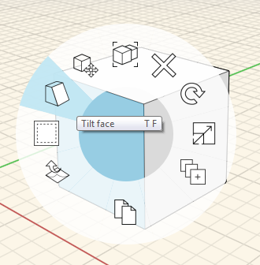
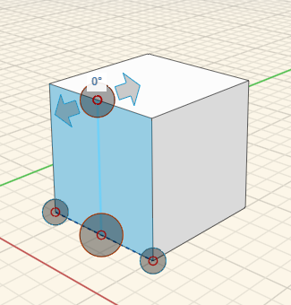
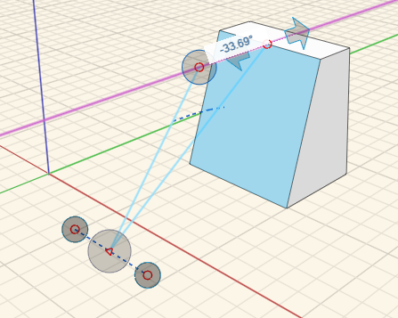

If you hover over a face and notice dotted lines - this means the face is made up of smaller faces due to the face being warped. To **turn the dotted lines into model edges**, first select the face - or object - and right-click to see the context menu. Then choose the facet icon from the context menu. This will add edges, where before the face was smooth.

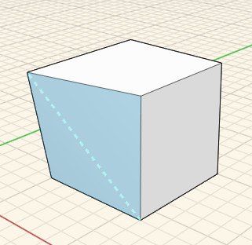
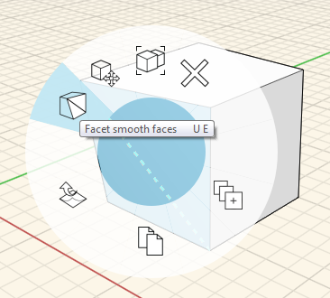
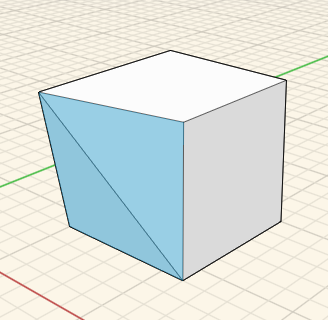

To **copy and paste faces, edges, or objects**, first select then choose the copy icon from the context menu. Then, bring up the context menu again to paste. When pasting you will have snap and inference options. Hold down the CTRL key and drag an object to make a quick copy.

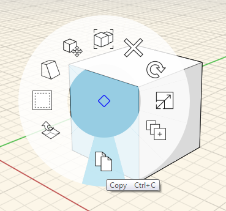
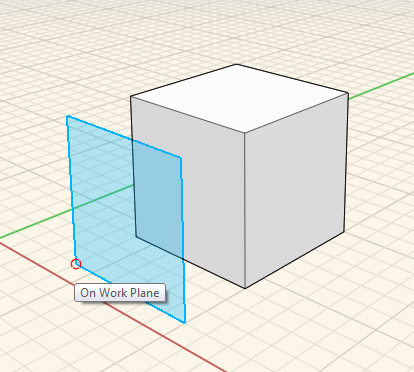

To **array edges, faces, or entire objects**, click on the array icon from the context menu. You can create both linear and radial arrays. Next, choose either linear or radial and then specify the other parameters. Then, similar to the move tool - click the object to start an array, and click again to place arrayed elements.

Linear:

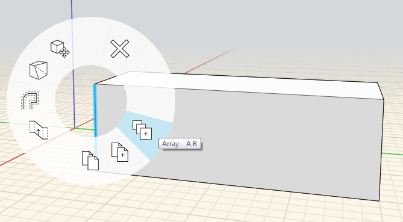
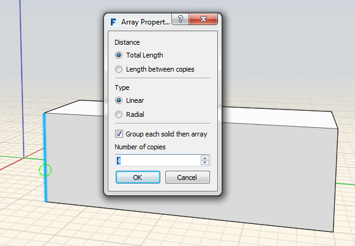
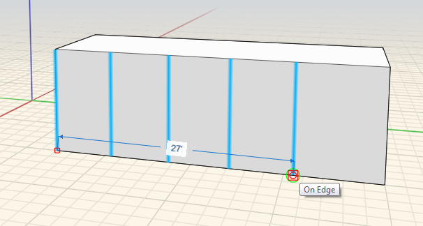

Radial:

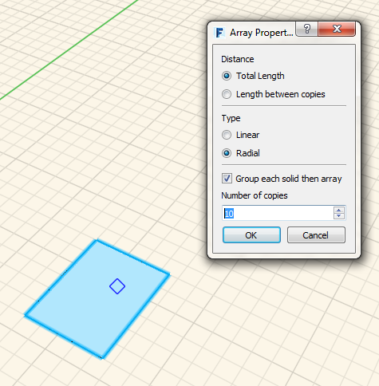
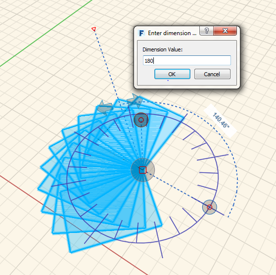
