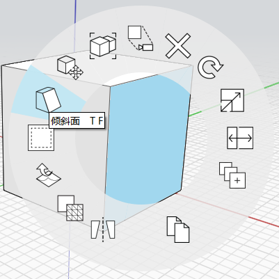

# Грани: наклон и дробление/сглаживание

## Работа с гранями: наклон и дробление/сглаживание

Для создания более сложных проектов после построения формы или размещения примитива можно использовать несколько контекстных инструментов для работы с геометрией. К этим инструментам относятся «Наклон», «Массив», а также «Копировать» и «Вставить».

### Наклон грани

Чтобы **наклонить грань**, выполните следующие действия.

1. Выберите грань и щелкните правой кнопкой мыши, чтобы открыть контекстное меню.
2. В контекстном меню выберите значок **Наклон**.
3. Определите ось наклона, нарисовав линию.
4. Щелкните третью точку, чтобы начать операцию наклона.

  
  

### Дробление/сглаживание граней

Если при наведении курсора на грань отображаются пунктирные линии, это означает, что грань состоит из небольших сегментов, которые появились вследствие деформации. Чтобы **преобразовать пунктирные линии в ребра модели**, выполните следующие действия.

1. Выберите грань или объект, который требуется изменить, и щелкните правой кнопкой мыши, чтобы открыть контекстное меню.
2. В контекстном меню выберите инструмент **Дробить/сгладить грани**.
3. Ребра будут автоматически добавлены в те места, где грань раньше была сглаженной.

Эта команда работает и в обратном направлении. Для этого выберите несколько смежных граней, затем в контекстном меню выберите инструмент **Дробить/сгладить грани**, чтобы скрыть ребра и получить сглаженные грани.

  

## 

