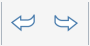

### Barras de ferramentas estendidas
---

#### Barra de ferramentas de ação
A barra de ferramentas está localizada na parte superior da tela. As ferramentas aqui o ajudarão a criar, editar e compartilhar conteúdo.

**1. Menu Gallery**

- Novo esboço, abrir esboço, salvar esboço, importar ou exportar arquivos.

**2. Undo Redo**

- Clique para desfazer ou refazer ações recentes.

**3. Selection and Measurement**

- Selection Filter: clique para escolher opções para descartar os tipos de objetos (arestas, faces, sólidos, grupos) na ferramenta de seleção.
- Measure Tools: clique para selecionar uma ferramenta de medição linear ou angular.

**4. Ferramentas de criação e modificação**

- Sketch Tools: clique para abrir um menu de ferramentas de criação (linha, arco, spline, retângulo, círculo) que o ajudarão a desenhar formas.
- Primitives: clique para abrir um menu de formas 3D básicas (cubo, domo, pirâmide, cilindro, telhado) que você pode colocar em sua cena.
- Advanced Modeling Tools: clique para usar operações booleanas de corte ou união, cobertura, varredura ou elevação.
- Groups: clique para localizar as ferramentas para agrupar objetos.

**5. Ferramentas de localização e análise**

- Location: pesquise a localização e importe imagens de satélite em seu esboço.
- Sun and Shadows: defina a hora e o dia para visualizar as sombras e iniciar uma análise solar em uma construção.
- Energy Analysis: clique para executar cálculos em uma construção para determinar seu uso de energia.

**6. User Identity**
- Settings: defina as configurações do aplicativo e do esboço junto com o estilo visual e execute o diagnósticos do modelo.
- Touch Mode: modele e navegue com dispositivos Windows sensíveis ao toque usando o dedo, a caneta stylus, o mouse e o teclado.
- Collaboration: inicie uma sessão, participe de uma sessão ou convide outras pessoas para colaborar.
- Login to Autodesk360: use os Serviços na nuvem do Autodesk 360 gratuitamente para armazenar e compartilhar os esboços.
- Help: use as ferramentas de informação para saber mais sobre o FormIt.

#### Barra de ferramentas de navegação
Consulte [Navegar na cena](../formit-introduction/navigating-the-scene.md).

#### Barra de paletas
A barra de paletas é exibida no lado direito da tela. Clique em um desses ícones para abrir uma paleta lateral para exibir propriedades de construção, materiais, uma biblioteca de conteúdo e ferramentas de colaboração.

**1. Properties** Abra essa paleta para visualizar a localização, a área bruta e as relações de área de piso para o esboço.

**2. Materials** Use essa paleta para criar ou aplicar materiais.

**3. Layers** Use essa paleta para criar e gerenciar camadas e atribuir os objetos selecionados a diferentes camadas.

**4. Scenes** Use essa paleta para criar, gerenciar e reproduzir cenas.

**5. Visual Styles** Use essa paleta para editar como o esboço é visualizado ao controlar sombras, superfícies, arestas e o ambiente.   

**6. Group Tree** Use essa paleta para visualizar grupos e objetos dentro de cada grupo.

**7. Dynamo** Use essa paleta para carregar e gerenciar modelos computacionais criados no Dynamo Studio.

**8. Levels** Use essa paleta para exibir e adicionar níveis aos objetos de construção.

**9. Content Library** Use a biblioteca de conteúdo para armazenar o conteúdo reutilizável, como mobiliário.

**10. Undo Manager** Use essa paleta para visualizar as ações de cada usuário ao colaborar.
