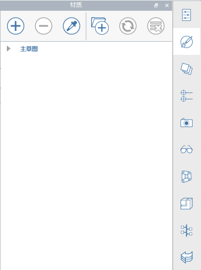

### Rozszerzone paski narzędzi
---

#### Pasek narzędzi operacji
Ten pasek narzędzi znajduje się w górnej części ekranu. Znajdujące się na nim narzędzia ułatwiają tworzenie, edytowanie i udostępnianie zawartości.

**1. Menu galerii**

- Nowy szkic, otwórz szkic, zapisz szkic, zaimportuj lub wyeksportuj pliki.

**2. Cofnij Ponów**

- Kliknij, aby cofnąć lub ponowić ostatnie operacje.

**3. Wybór i pomiar**

- Filtr wyboru — kliknij, aby wybrać opcje filtrowania typów obiektów (krawędzi, powierzchni, brył, grup) z narzędzia wyboru.
- Narzędzia pomiaru — kliknij, aby wybrać narzędzie pomiaru liniowego lub kątowego.

**4. Narzędzia do tworzenia i modyfikacji**

- Narzędzia do szkicowania — kliknij, aby wywołać menu narzędzi do tworzenia (linia, łuk, splajn, prostokąt, okrąg), które ułatwiają rysowanie kształtów.
- Prymitywy — kliknij, aby wywołać menu podstawowych kształtów 3D (sześcian, kopuła, ostrosłup, walec, dach), które można umieścić w scenie.
- Zaawansowane narzędzia modelowania — kliknij, aby użyć operacji logicznych wycinania lub łączenia, zakrywania, przeciągania lub wyciągnięcia złożonego.
- Grupy — kliknij, aby znaleźć narzędzia do grupowania obiektów.

**5. Narzędzia położenia i analizy**

- Położenie — wyszukaj położenie i zaimportuj obrazy satelitarne do szkicu.
- Słońce i cienie — ustaw godzinę i dzień, aby wyświetlić cienie i rozpocząć analizę oświetlenia naturalnego budynku.
- Analiza energetyczna — kliknij, aby wykonać obliczenia dla budynku w celu określenia jego zużycia energii.

**6. Tożsamość użytkownika**

- Ustawienia — skonfiguruj ustawienia aplikacji i szkicu oraz styl wizualny, a także przeprowadź diagnostykę modelu.
- Tryb dotyku — modeluj i nawiguj na urządzeniach dotykowych systemu Windows, wykorzystując palec, pióro, mysz i klawiaturę.
- Współpraca — rozpocznij sesję, dołącz do sesji lub zaproś innych użytkowników do współpracy.
- Zaloguj się w usłudze Autodesk 360: bezpłatnie przechowuj i udostępniaj szkice w usłudze Autodesk 360 Cloud Services.
- Pomoc: więcej informacji na temat programu FormIt można znaleźć w narzędziach informacyjnych.

#### Pasek narzędzi nawigacji
Zobacz temat [Nawigacja po scenie](../formit-introduction/navigating-the-scene.md).

#### Pasek palety
Pasek palety jest widoczny po prawej stronie ekranu. Kliknij jedną z tych ikon, aby otworzyć paletę boczną w celu wyświetlenia właściwości budynku, materiałów, Biblioteki elementów i narzędzi do współpracy.

**1. Właściwości** Otwórz tę paletę, aby wyświetlić położenie, powierzchnię brutto i współczynniki powierzchni kondygnacji dla szkicu.

**2. Materiały** Ta paleta służy do tworzenia lub stosowania materiałów.

**3. Warstwy** Ta paleta służy do tworzenia warstw i zarządzania nimi oraz przypisywania wybranych obiektów do różnych warstw.

**4. Sceny** Ta paleta służy do tworzenia scen, zarządzania nimi i ich odtwarzania.

**5. Style wizualne** Ta paleta służy do edycji sposobu wyświetlania szkicu przez sterowanie cieniami, powierzchniami, krawędziami i środowiskiem.   

**6. Drzewo grup** Ta paleta służy do wyświetlania grup i obiektów w poszczególnych grupach.

**7. Dynamo** Ta paleta służy do wczytywania modeli obliczeniowych utworzonych w programie Dynamo Studio i zarządzania nimi.

**8. Poziomy** Ta paleta służy do wyświetlania i dodawania poziomów do obiektów budynku.

**9. Biblioteka elementów** Biblioteka elementów służy do przechowywania elementów wielokrotnego użytku, takich jak meble.

**10. Menedżer cofania** Ta paleta służy do wyświetlania operacji poszczególnych użytkowników podczas współpracy.
