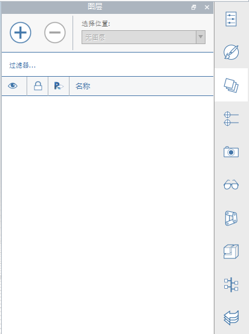
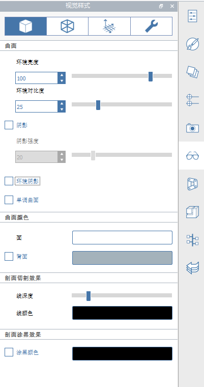

### 확장된 도구막대
---

#### 작업 도구막대
도구막대는 화면 상단에 있습니다. 여기에 있는 도구는 컨텐츠를 작성, 편집 및 공유하는 데 도움이 됩니다.

**1. 갤러리 메뉴**

- 새 스케치, 스케치 열기, 스케치 저장, 파일 가져오기 또는 파일 내보내기

**2. 실행취소 재실행**
- 최근 작업을 실행취소하거나 재실행하려면 클릭합니다.

**3. 선택 및 측정**
- 선택 필터: 선택 도구에서 객체 유형(모서리, 면, 솔리드, 그룹)을 필터링하기 위한 옵션을 선택하려면 클릭합니다.
- 측정 도구: 선형 또는 각도 측정 도구를 선택하려면 클릭합니다.

**4. 작성 및 수정 도구**
- 스케치 도구: 모양을 그리는 데 도움이 되는 작성 도구(선, 호, 스플라인, 직사각형, 원) 메뉴를 표시하려면 클릭합니다.
- 원형: 장면에 배치할 수 있는 기본 3D 모양(정육면체, 돔, 피라미드, 원통, 지붕)의 메뉴를 표시하려면 클릭합니다.
- 고급 모델링 도구: 부울 절단 또는 결합, 피복, 스윕 또는 로프트 작업을 사용하려면 클릭합니다.
- 그룹: 객체를 그룹화하기 위한 도구를 찾으려면 클릭합니다.

**5. 위치 및 해석 도구**
- 위치: 위치를 검색하고 위성 이미지를 스케치로 가져옵니다.
- 태양 및 그림자: 그림자를 보려는 시간과 날짜를 설정하고, 건물에 대한 일조 해석을 시작합니다.
- 에너지 해석: 에너지 사용을 파악하기 위해 건물에 대한 계산을 수행하려면 클릭합니다.

**6. 사용자 ID**

- 설정: 비주얼 스타일에 따라 응용프로그램 및 스케치 설정을 지정하고 모델 진단을 수행합니다.
- 터치 모드: 손가락, 스타일러스, 마우스 및 키보드를 사용하여 터치를 지원하는 Windows 장치로 모델링 및 탐색을 수행합니다.
- 공동작업: 세션을 시작하거나, 세션에 참가하거나, 공동작업을 위해 다른 사용자를 초대합니다.
- Autodesk 360에 로그인: 스케치를 무료로 저장하고 공유하려면 Autodesk 360 클라우드 서비스를 사용합니다.
- 도움말: FormIt에 대해 자세히 알아보려면 정보 도구를 사용합니다.

#### 탐색 도구막대
[장면 탐색](../formit-introduction/navigating-the-scene.md)을 참고하십시오.

#### 팔레트 막대
팔레트 막대가 화면 오른쪽에 나타납니다. 건물 특성, 재료, 컨텐츠 라이브러리 및 공동작업 도구를 표시하려면 이러한 아이콘 중 하나를 클릭하여 측면 팔레트를 엽니다.

**1. 특성** 스케치의 위치, 총 면적 및 바닥 면비를 확인하려면 이 팔레트를 엽니다.

**2. 재료** 재료를 작성하거나 적용하려면 이 팔레트를 사용합니다.

**3. 레이어** 레이어를 작성 및 관리하고 선택한 객체를 다른 레이어에 지정하려면 이 팔레트를 사용합니다.

**4. 장면** 장면을 작성, 관리 및 재생하려면 이 팔레트를 사용합니다.

**5. 비주얼 스타일** 그림자, 표면, 모서리 및 환경을 제어하여 스케치가 표시되는 방식을 편집하려면 이 팔레트를 사용합니다.   

**6. 그룹 트리** 그룹 및 각 그룹 내의 객체를 보려면 이 팔레트를 사용합니다.

**7. Dynamo** Dynamo Studio에서 작성된 계산 모델을 로드하고 관리하려면 이 팔레트를 사용합니다.

**8. 레벨** 건물 객체를 표시하고 건물 객체에 레벨을 추가하려면 이 팔레트를 사용합니다.

**9. 컨텐츠 라이브러리** 가구와 같은 재사용 가능한 컨텐츠를 저장하려면 컨텐츠 라이브러리를 사용합니다.

**10. 실행취소 관리자** 공동작업 시 각 사용자의 동작을 보려면 이 팔레트를 사용합니다.
