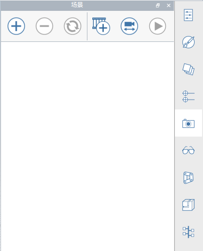
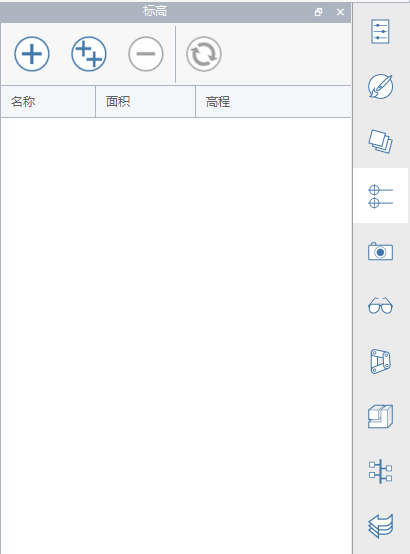

### Barre degli strumenti estese
---

#### Barra degli strumenti delle azioni
La barra degli strumenti si trova nella parte superiore della schermata. Gli strumenti qui disponibili consentono di creare, modificare e condividere contenuto.

**1. Menu della raccolta**

- Nuovo disegno, apertura del disegno, salvataggio del disegno, importazione o esportazione di file.

**2. Annulla/Ripeti**

- Fare clic per annullare o ripetere le azioni recenti.

**3. Selezione e misurazione**

- Filtro di selezione: fare clic per scegliere le opzioni per filtrare i tipi di oggetto (bordi, superfici, solidi, gruppi) dallo strumento di selezione.
- Strumenti di misurazione: fare clic per scegliere uno strumento di misurazione lineare o angolare.

**4. Strumenti di creazione e modifica**

- Strumenti di disegno: fare clic per visualizzare un menu di strumenti di creazione (linea, arco, spline, rettangolo, cerchio) che consentono di disegnare forme.
- Primitive: fare clic per visualizzare un menu di forme 3D di base (cubo, cupola, piramide, cilindro, tetto) che è possibile inserire nella scena.
- Strumenti di modellazione avanzati: fare clic per utilizzare operazioni booleane di taglio o unione, copertura, estrusione su percorso o loft.
- Gruppi: fare clic per individuare gli strumenti per il raggruppamento di oggetti.

**5. Strumenti di posizione e analisi**

- Posizione: consente di cercare la posizione e importare immagini satellitari nel disegno.
- Sole e ombre: consentono di impostare ora e giorno per visualizzare le ombre e avviare un'analisi solare in un edificio.
- Analisi energetica: fare clic per eseguire calcoli in un edificio per determinarne il consumo energetico.

**6. Identità utente**

- Impostazioni: consente di impostare le impostazioni dell'applicazione e del disegno insieme allo stile di visualizzazione e di eseguire la diagnostica del modello.
- Modalità tocco: consente di modellare e navigare con i dispositivi Windows abilitati al tocco utilizzando il dito, lo stilo, il mouse e la tastiera.
- Collaborazione: consente di avviare una sessione, partecipare ad una sessione o invitare altri utenti a collaborare.
- Accesso ad Autodesk 360: utilizzare i servizi cloud di Autodesk 360 gratuitamente per memorizzare e condividere i disegni.
- Guida: utilizzare gli strumenti informativi per ulteriori informazioni su FormIt.

#### Barra degli strumenti Navigazione
Vedere [Navigazione nella scena](../formit-introduction/navigating-the-scene.md).

#### Barra delle tavolozze
La barra delle tavolozze viene visualizzata sul lato destro della schermata. Fare clic su una di queste icone per aprire una tavolozza laterale per visualizzare le proprietà dell'edificio, i materiali, una libreria di contenuti e gli strumenti di collaborazione.

**1. Proprietà** aprire questa tavolozza per visualizzare i rapporti tra la posizione, l'area lorda e le aree del pavimento per il disegno.

**2. Materiali** utilizzare questa tavolozza per creare o applicare materiali.

**3. Layer** utilizzare questa tavolozza per creare e gestire i layer e assegnare gli oggetti selezionati a layer diversi.

**4. Scene** utilizzare questa tavolozza per creare, gestire e riprodurre le scene.

**5. Stili visualizzazione** utilizzare questa tavolozza per modificare la modalità di visualizzazione del disegno controllando ombre, superfici, bordi e ambiente.   

**6. Struttura gruppi** utilizzare questa tavolozza per visualizzare i gruppi e gli oggetti all'interno di ciascun gruppo.

**7. Dynamo** utilizzare questa tavolozza per caricare e gestire i modelli di calcolo creati in Dynamo Studio.

**8. Livelli** utilizzare questa tavolozza per visualizzare e aggiungere livelli agli oggetti degli edifici.

**9. Libreria del contenuto** utilizzare la libreria di contenuti per memorizzare contenuto riutilizzabile, ad esempio l'arredo.

**10. Gestione operazioni annullate** utilizzare questa tavolozza per visualizzare le azioni di ciascun utente durante la collaborazione.
