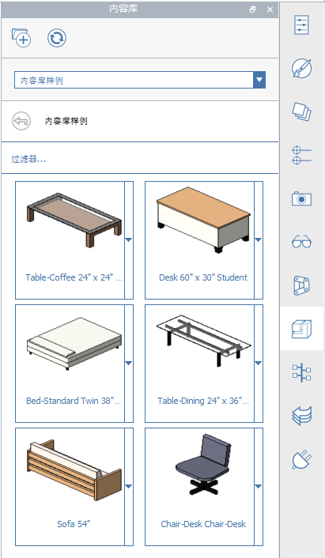

### Расширенные панели инструментов
---

#### Панель инструментов «Действия»
Панель инструментов находится в верхней части экрана. Инструменты помогают создавать, редактировать содержимое и выполнять совместную работу с ним.

**1. Меню «Галерея»**

- Новый эскиз, открыть эскиз, сохранить эскиз, импортировать или экспортировать файлы.

**2. Отмена и повтор**

- Нажмите, чтобы отменить или повторить последние действия.

**3. Выбор и измерение**

- Фильтр выбора: щелкните, чтобы выбрать параметры фильтрации типов объектов (ребра, грани, тела, группы) в инструменте выбора.
- Инструменты измерения: выберите инструмент для измерения прямой или угла.

**4. Инструменты создания и изменения**

- Инструменты эскиза: щелкните, чтобы открыть меню инструментов создания (линия, дуга, сплайн, прямоугольник, окружность), которые позволяют рисовать формы.
- Примитивы: щелкните, чтобы открыть меню базовых 3D-форм (куб, купол, пирамида, цилиндр, крыша), которые можно разместить в сцене.
- Дополнительные инструменты моделирования: щелкните, чтобы использовать логические операции вырезания и присоединения, покрывания, сдвига и построения лофта.
- Группы: щелкните, чтобы найти инструменты для группирования объектов.

**5. Инструменты местоположения и расчета**

- Местоположение: поиск местоположения и импорт спутниковых снимков в эскиз.
- Солнце и тени: задание времени и даты для просмотра теней и запуска расчета инсоляции в здании.
- Расчет энергопотребления: щелкните для расчета энергопотребления здания.

**6. Идентификация пользователя**

- Параметры: настройка параметров приложения и эскиза, а также визуального стиля и выполнение диагностики модели.
- Сенсорный режим: моделирование и навигация на сенсорных устройствах Windows с помощью пальца, пера, мыши и клавиатуры.
- Совместная работа: запуск сеанса, присоединение к сеансу и приглашение других пользователей для совместной работы.
- Вход в Autodesk 360: использование облачных служб Autodesk 360 для бесплатного хранения и совместного использования эскизов.
- Справка: использование информационных инструментов для получения дополнительных сведений о FormIt.

#### Панель навигации
См. раздел [Навигация по сцене](../formit-introduction/navigating-the-scene.md).

#### Панель палитр
Панель палитр отображается в правой части экрана. Щелкните один из этих значков, чтобы открыть боковую палитру, содержащую свойства здания, материалы, библиотеку компонентов и инструменты для совместной работы.

**1. Свойства**: палитра служит для просмотра местоположения, общей площади и коэффициентов площади пола для эскиза.

**2. Материалы**: палитра служит для создания и применения материалов.

**3. Слои**: палитра служит для создания слоев и управления ими, а также для назначения выбранных объектов различным слоям.

**4. Сцены**: палитра служит для создания сцен, управления ими и их воспроизведения.

**5. Визуальные стили**: палитра используется для редактирования вида эскиза путем управления тенями, поверхностями, ребрами и средой.   

**6. Дерево групп**: палитра используется для просмотра групп и объектов в каждой группе.

**7. Dynamo**: палитра используется для загрузки расчетных моделей, созданных в Dynamo Studio, и управления ими.

**8. Уровни**: палитра используется для отображения уровней и их добавления к строительным объектам.

**9. Библиотека компонентов**: библиотека компонентов используется для хранения повторно используемых компонентов, например мебели.

**10. Диспетчер отмены**: палитра используется для просмотра действий каждого пользователя при совместной работе.
