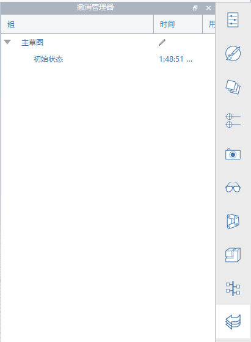

### Erweiterte Werkzeugkästen
---

#### Aktionsleiste
Die Aktionsleiste befindet sich am oberen Rand des Bildschirms. Mithilfe ihrer Werkzeuge können Sie Inhalte erstellen, bearbeiten und freigeben.

**1. Gallery Menu (Galerie-Menü)**

- New sketch, open sketch, save sketch, import or export files (Neue Skizze, Skizze öffnen, Skizze speichern, Dateien importieren oder exportieren).

**2. Undo Redo (Rückgängig Wiederherstellen)**

- Klicken Sie auf Undo (Rückgängig) oder Redo (Wiederherstellen), um die zuletzt ausgeführten Aktionen rückgängig zu machen oder wiederherzustellen.

**3. Selection and Measurement (Auswahl und Messung)**

- Selection Filter (Auswahlfilter): Klicken Sie hier, um Optionen zum Herausfiltern von Objekttypen (Kanten, Flächen, Volumenkörper, Gruppen) aus dem Auswahlwerkzeug zu wählen.
- Measure Tools (Messwerkzeuge): Klicken Sie hier, um ein Werkzeug für Linear- oder Winkelmessung zu wählen.

**4. Creation and Modification Tools (Erstellungs- und Bearbeitungswerkzeuge)**

- Sketch Tools (Skizzierwerkzeuge): Klicken Sie hier, um ein Menü mit Erstellungswerkzeugen aufzurufen (Linie, Bogen, Spline, Rechteck, Kreis), mit deren Hilfe Sie Formen zeichnen können.
- Primitives (Grundkörper): Klicken Sie hier, um ein Menü mit 3D-Grundformen aufzurufen (Würfel, Kuppel, Pyramide, Zylinder, Dach), die Sie in Ihrer Szene platzieren können.
- Advanced Modeling Tools (Erweiterte Modellierungswerkzeuge): Klicken Sie hier, um Boolesche Schnitt- und Vereinigungsfunktionen, Abdeckungen, Sweeps oder Erhebungen zu verwenden.
- Groups (Gruppen): Hier finden Sie Werkzeuge für die Gruppierung von Objekten.

**5. Location and Analysis Tools (Standort- und Analysewerkzeuge)**

- Location (Standort): Suchen Sie nach einem Standort, und importieren Sie Satellitenbilder in Ihre Skizze.
- Sun and Shadows (Sonne und Schatten): Legen Sie die Uhrzeit und den Tag fest, um Schatten anzuzeigen, und beginnen Sie mit einer Solaranalyse für ein Gebäude.
- Energy Analysis (Energieanalyse): Klicken Sie hier, um Berechnungen für den Energieverbrauch eines Gebäudes durchzuführen.

**6. User Identity (Benutzeridentität)**

- Settings (Einstellungen): Hier können Sie Anwendungs- und Skizzeneinstellungen, den Bildstil sowie Diagnosefunktionen für das Modell festlegen.
- Touch Mode (Berührungsmodus): Modellieren und navigieren Sie auf berührungsempfindlichen Windows-Geräten per Finger, Stift, Maus und Tastatur.
- Collaboration (Zusammenarbeit): Starten Sie eine Sitzung, nehmen Sie an einer Sitzung teil, oder laden Sie andere zur Zusammenarbeit ein.
- Login to Autodesk360 (Anmeldung bei Autodesk 360): Verwenden Sie die Autodesk 360-Cloud-Services kostenlos zum Speichern und Freigeben Ihrer Skizzen.
- Help (Hilfe): Mithilfe der Informationswerkzeuge lernen Sie FormIt noch besser kennen.

#### Navigationsleiste
Siehe [Navigieren in der Szene](../formit-introduction/navigating-the-scene.md).

#### Palettenleiste
Die Palettenleiste wird auf der rechten Seite des Bildschirms angezeigt. Durch Klicken auf eines dieser Symbole öffnen Sie eine seitliche Palette mit Gebäudeeigenschaften, Materialien, einer Inhaltsbibliothek sowie Werkzeugen für die Zusammenarbeit.

**1. Properties (Eigenschaften)**: Öffnen Sie diese Palette, um den Standort, die Bruttofläche sowie Bodenflächenverhältnisse für Ihre Skizze anzuzeigen.

**2. Materials (Materialien)**: Verwenden Sie diese Palette zum Erstellen oder Anwenden von Materialien.

**3. Layer**: Verwenden Sie diese Palette, um Layer zu erstellen und zu verwalten und um ausgewählte Objekte verschiedenen Layern zuzuweisen.

**4. Scenes (Szenen)**: Verwenden Sie diese Palette zum Erstellen, Verwalten und Wiedergeben von Szenen.

**5. Visual Styles (Visuelle Stile)**: Verwenden Sie diese Palette, um die Anzeige der Skizze zu bearbeiten, indem Sie Schatten, Flächen, Kanten und die Umgebung steuern.   

**6. Group Tree (Gruppenstruktur)**: Verwenden Sie diese Palette, um Gruppen und Objekte innerhalb jeder Gruppe anzuzeigen.

**7. Dynamo**: Verwenden Sie diese Palette zum Laden und Verwalten von in Dynamo Studio erstellten Berechnungsmodellen.

**8. Levels (Ebenen)**: Verwenden Sie diese Palette zum Anzeigen und Hinzufügen von Ebenen zu Gebäudeobjekten.

**9. Content Library (Inhaltsbibliothek)**: In der Inhaltsbibliothek können Sie wiederverwendbare Inhalte wie etwa Möbel speichern.

**10. Undo Manager (Rückgängig-Manager)**: Verwenden Sie diese Palette, um die Aktionen der einzelnen Benutzer bei der Zusammenarbeit anzuzeigen.
