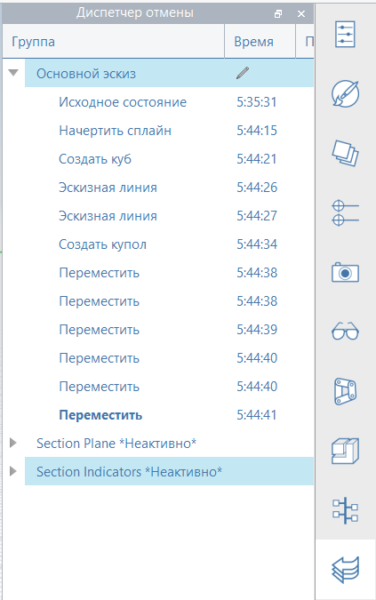

# Undo Manager

FormIt features a unique Undo/Redo system, which can be used in two different ways to either undo per-Group, or chronologically and globally:

* Undo/Redo while editing a nested Group will only affect the changes inside that Group
  * This means you can make a change in this Group, then make many changes in other Groups, and return to the original Group and have the option to Undo the last change made in this Group without affecting changes made more recently, elsewhere
* Undo/Redo from the Main Sketch \(not while editing a Group\) acts like traditional Undo/Redo systems: the last change made in **any** Group will be undone, based on chronological order.

  The Undo Manager records every change inside every Group in your FormIt model, including changes made in the Main Sketch. This is useful for visually understanding which operations have been undone in any Group in the model.

The Undo Manager will indicate in **bold** the current state, as well as any operations before this state, and any operations that once existed but have since been undone.

You can right-click a state and select "Roll To" to effectively Undo or Redo as necessary to return to that model state.

Groups that have been explicitly deleted, or are no longer in existence due to an Undo or Redo, are shown as \*Inactive\*. These can be restored by Undoing or Redoing inside their parent Group until they come back into existence.

