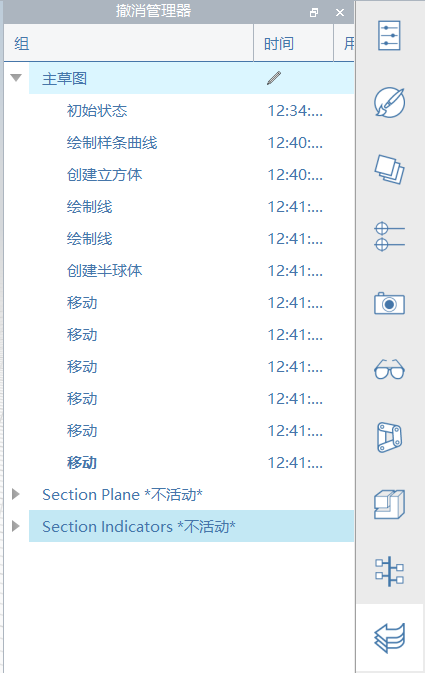

# Rückgängig-Manager

FormIt bietet ein einzigartiges Rückgängig-/Wiederherstellen-System, das auf zwei verschiedene Arten verwendet werden kann, um Vorgänge entweder gruppenweise oder chronologisch und global rückgängig zu machen:

* Die Optionen Rückgängig/Wiederherstellen beim Bearbeiten einer verschachtelten Gruppe wirken sich nur auf die Änderungen innerhalb dieser Gruppe aus.
   * Das bedeutet, Sie können diese Gruppe ändern, dann zahlreiche Änderungen in anderen Gruppen vornehmen, zur ursprünglichen Gruppe zurückkehren und die letzte Änderung in dieser Gruppe rückgängig machen, ohne dass die zuletzt vorgenommenen Änderungen an anderer Stelle davon betroffen sind.
* Die Optionen Rückgängig/Wiederherstellen in der Hauptskizze \(nicht während der Bearbeitung einer Gruppe\) verhalten sich wie herkömmliche Systeme zum Rückgängigmachen/Wiederherstellen: Die letzte Änderung in **jeder beliebigen** Gruppe wird in chronologischer Reihenfolge rückgängig gemacht.

Der Rückgängig-Manager zeichnet alle Änderungen in jeder Gruppe Ihres FormIt-Modells auf, einschließlich der Änderungen in der Hauptskizze. Dies ist nützlich, um visuell darzustellen, welche Operationen in einer Gruppe im Modell rückgängig gemacht wurden.

Der Rückgängig-Manager zeigt den aktuellen Status in **Fettdruck** an, ebenso wie alle Operationen vor diesem Status und alle Operationen, die einmal vorhanden waren, jedoch rückgängig gemacht wurden.

Sie können mit der rechten Maustaste auf einen Status klicken und Drehung zu auswählen, um effektiv alle Operationen rückgängig zu machen oder wiederherzustellen, bis Sie zu diesem Modellstatus zurückgekehrt sind.

Gruppen, die explizit gelöscht wurden oder aufgrund eines Rückgängig- oder Wiederherstellen-Vorgangs nicht mehr vorhanden sind, werden als \*Inaktiv\* angezeigt. Diese können durch Rückgängigmachen oder Wiederherstellen innerhalb der übergeordneten Gruppe wiederhergestellt werden, bis sie wieder existieren.

