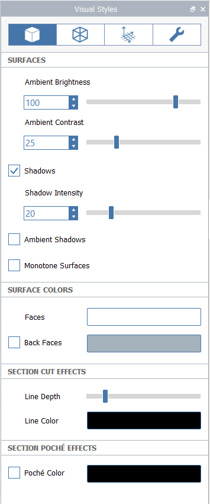

# Visual Styles

Customize the visual appearance of your model, including overall lighting, edge styles, and environmental effects.

Visual Styles [can be set per-Scene](https://windows.help.formit.autodesk.com/building-the-farnsworth-house/visual-settings), so you can save your favorite styles settings and apply them to other Scenes.

## Surfaces

**Ambient Brightness** controls the overall brightness of all materials in the scene. A value of 100 means materials exposed to light will display at their full brightness as defined in the material's color or texture. Values over 100 will over-expose materials, but may be useful for SketchUp models that still look dark in FormIt. The default value is 100.

**Ambient Contrast** controls how much darker faces in shade appear, when compared to faces exposed to direct sunlight. A value of 0 means that lighting has no effect \(all materials will appear at their full brightness regardless of orientation\), whereas higher values will make faces in shade appear increasingly darker. The default value is 25.

Toggle **Shadows** to see how your design would be [shaded at the current time of day](https://windows.help.formit.autodesk.com/tool-library/shadows).

**Shadow Intensity** controls how dark shadows draw on the ground plane and other faces. A value of 0 will make shadows effectively invisible, and a value of 100 will make shadows black. The default value is 20.

**Ambient Shadows** add a touch of shading to corners to add realism to your FormIt model. 

**Monotone Surfaces** disables the color and texture of all materials, and makes the surrounding environment white. Useful for shadow or shading studies.

The Surface Colors section defines default colors for faces when no material is applied.

**Faces** is the default color of all front-facing FormIt faces \(or both sides, if Back Faces is unchecked\) when no material is applied.

**Back Faces** is used to display different materials on either side of a single face, for SketchUp models that are imported into FormIt and require this. This option is unchecked by default, but is checked when SketchUp models are opened or imported. In non-SketchUp geometry, the specified Back Face color will shown on the back sides of faces.

Use the Section Cut Effects and Section Poche Effects sections to manage the default colors of faces, lines and the poché effect when the[ Section Plane](section-planes.md) tool is used.

## Edges

Manage the display style of edges.

**Contrast** affects how visible all edges are. A value of 0 would make the edges effectively invisible. The default value is 60.

**Color** affects the color of all edges in the model. The default is black.

**Thick Edges** make all edges thicker, including Silhouette Edges.

**Sketchy Edges** adds a sketchy effect to all edges, to simulate a hand-drawn effect.

**Hidden Edges** displays edges otherwise occluded by surfaces.

**Extended Edges** adds an extension to some edges, to simulate a hand-drawn effect.

## Environment

Toggle display of environmental effects and objects.

**Grid** controls the display of the grid on the ground plane, as well as the grid shown when editing a Group. The "Snap to Grid" option will be disabled when the Grid is disabled.

**Axes** controls the display of the XYZ axes that shows up at the world origin, or at the Group origin if editing a Group.

**Levels** controls the display of [**Levels**](levels-and-area.md) ****set in the Levels Panel.

**Fog** controls the display of fog that is drawn to make the transition between the ground plane and the sky appear seamless. Turning off Fog will result in a hard horizon line where the ground plane \(if enabled\) meets the sky.

**North Arrow** controls the display of a small graphical widget that indicates the direction of project north \(as determined by location and satellite imagery\).

Environmental colors like sky, background, and ground plane can also be customized.

The sky is comprised of a gradient of **Lower / Background**, **Middle**, and **Upper** colors. 

If the **Sky** option is unchecked, only the **Lower / Background** color will be visible.

## Diagnostics

Toggle the display of diagnostic tools. 

**Watertight Issues** highlights in red all edges that are not part of a watertight solid object.

**Back Faces** highlights in red all faces that are facing the wrong way \(all solid objects should have the back faces facing towards the inside of the solid shape\).

[Learn more about using Watertight and Back Faces diagnostics to identify and fix issues with solid models](https://www.youtube.com/watch?v=XFL-b1DgZiQ).

