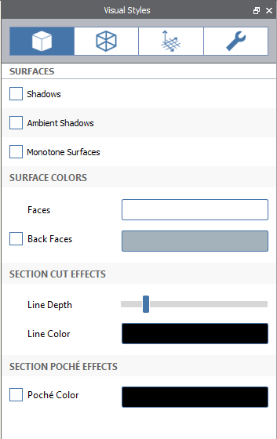
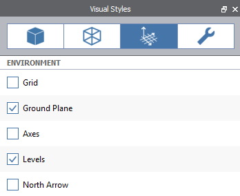

# Visual Styles

Going beyond the default look and feel of FormIt graphics is easy and all of the settings are located in one place. The important thing to remember about visual styles is that they are scene specific so you can set up different moods for different perspectives all in the same model

Learn more about how to use Visual Styles [**here**](../building-the-farnsworth-house/visual-settings.md)

## Surfaces

Toggle on shadows from sun direction, ambient shadows and Monotone mode - which turns the entire scene black and white

Manage the default colors of faces, lines and the poche’ effect when the[ Section Plane](section-planes.md) tool is used

## Edges

Manage the display of edges and silhouettes

## Environment

Toggle display of environment visual settings

## Diagnostics

Toggle the display of diagnostic tools. Watertight issues highlights in red all edges that are not part of a watertight solid object

