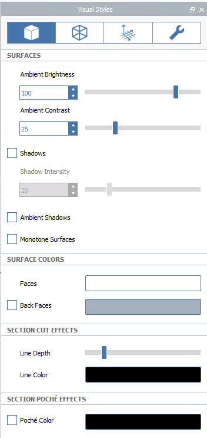
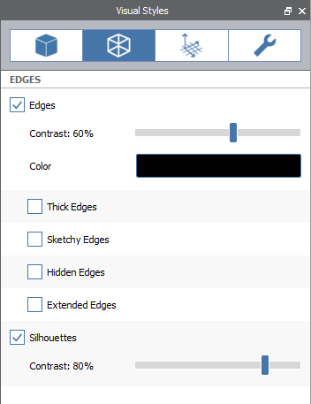
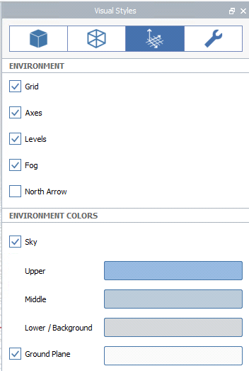
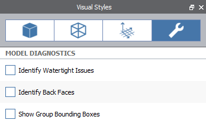

# Visual Styles

Customize the visual appearance of your model, including overall lighting, edge styles, and environmental effects.

Visual Styles [can be set per-Scene](https://windows.help.formit.autodesk.com/building-the-farnsworth-house/visual-settings), so you can save your favorite styles settings and apply them to other Scenes.

## Surfaces

**Ambient Brightness** controls the overall brightness of all materials in the scene. A value of 100 means materials exposed to light will display at their full brightness. Values over 100 will over-expose materials, but may be useful for SketchUp models that still look dark in FormIt. The default value is 100.

**Ambient Contrast** controls how much darker faces in shade appear, when compared to faces exposed to direct sunlight. A value of 0 means that lighting has no effect \(all materials will appear at their full brightness regardless of orientation\), whereas higher values will make faces in shade appear increasingly darker. The default value is 25.

Toggle **Shadows** to see how your design would be [shaded at the current time of day](https://windows.help.formit.autodesk.com/tool-library/shadows).

**Shadow Intensity** controls how dark shadows draw on the ground plane and other faces. A value of 0 will make shadows effectively invisible, and a value of 100 will make shadows black. The default value is 20.

**Ambient Shadows** add a touch of shading to corners to add a touch of realism to your FormIt model. 

**Monotone Surfaces** disables the color and texture of all materials, and makes the surrounding environment white. Useful for shadow or shading studies.

Use the Section Cut Effects and Section Poche Effects sections to manage the default colors of faces, lines and the poché effect when the[ Section Plane](section-planes.md) tool is used.

## Edges

Manage the display of edges and silhouettes

## Environment

Toggle display of environment visual settings such as the **Grid**, **Axes**, [**Levels**](levels-and-area.md), **Fog**, and **North Arrow**.

The sky colors are comprised of a gradient of **Lower / Background**, **Middle**, and **Upper** colors. Only the **Lower / Background** color is visible when the **Sky** is unchecked.

## Diagnostics

Toggle the display of diagnostic tools. 

**Watertight Issues** highlights in red all edges that are not part of a watertight solid object.

**Back Faces** highlights in red all faces that are facing the wrong way \(all solid objects should have the back faces facing towards the inside of the solid shape\).

[Learn more about using Watertight and Back Faces diagnostics to identify and fix issues with solid models](https://www.youtube.com/watch?v=XFL-b1DgZiQ).

