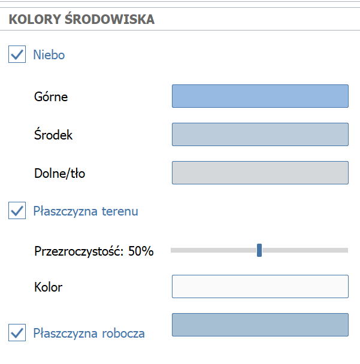
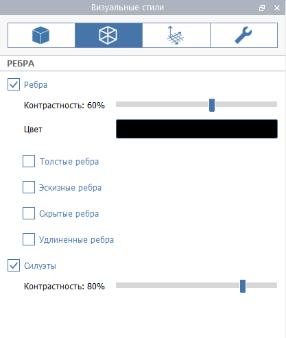
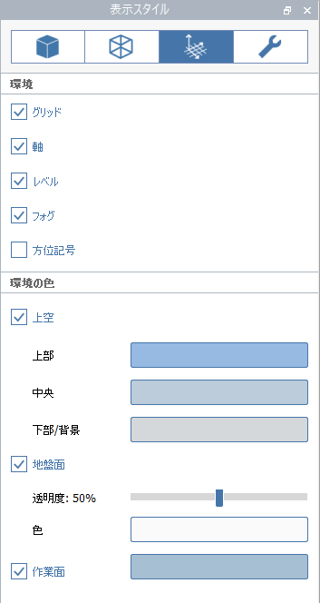
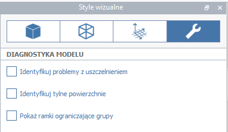

# 視覺型式

自訂模型的視覺外觀，包括整體照明、邊型式和環境效果。按一下選項板列中的太陽眼鏡圖示，即可找到「視覺型式」面板：

您可以[根據場景設定](https://windows.help.formit.autodesk.com/building-the-farnsworth-house/visual-settings)視覺型式，以便您可以儲存最愛的型式設定，並將其套用至其他場景。

## 表面

管理表面的顯示和描影方式。

**環境亮度**控制場景中所有材料的整體亮度。值 100 表示暴露在光線下的材料將以其完整亮度顯示，如材料的顏色或材質所定義。值超過 100 會過度曝光材料，但對於在 FormIt 中看起來還是很暗的 SketchUp 模型可能會很有用。預設值為 100。

**環境對比**控制與日光直接照射的面相比，描影中的面會變暗多少。值 0 表示照明沒有效果 \(所有材料都會以其全亮度顯示，不考慮方位\)，值越高，描影中的面越暗。預設值為 25。

切換**「陰影」**，可查看設計[在目前一天當中的時間如何描影](https://windows.help.formit.autodesk.com/tool-library/shadows)。

**陰影強度**控制在地平面和其他面上繪製暗陰影的方式。值 0 將使陰影相當於看不見，值 100 將使陰影變黑。預設值為 20。

**環境陰影**可在角點加入一點描影，以在 FormIt 模型中增加擬真度。

**單調表面**可停用所有材料的顏色和材質，並讓周圍環境變白。這對陰影或描影研究很有用。

「表面顏色」區段定義未套用材料時，面的預設顏色。

**面**是未套用任何材料時，所有正面 FormIt 面的預設顏色 \(如果未勾選「背面」則為兩側\)。

**背面**用於在單一面的任一側顯示不同材料，適用於匯入至 FormIt 且需要此功能的 SketchUp 模型。此選項預設處於未勾選狀態，但在開啟或匯入 SketchUp 模型時，會勾選此選項。在非 SketchUp 幾何圖形中，指定的背面顏色將顯示在面的背面。

使用「剖面切割效果」和「剖面塗黑效果」區段，可在使用[剖面平面](section-planes.md)工具時管理面、線和塗黑效果的預設顏色。

## 地平面

在「群組編輯模式」中關閉「地平面」時，藍色的工作平面格線現在也會關閉。

您也可以從「視覺型式」面板自訂工作平面的顏色。

## 邊

管理模型中所有邊的顯示型式。

**對比**影響所有邊的可見性。值 0 會讓邊相當於看不見。預設值為 60。

**顏色**影響模型中所有邊的顏色。預設為黑色。

**厚邊**會讓所有邊 \(包括剪影邊\) 變厚。

**手繪邊**會在所有邊加入手繪效果，以模擬手繪效果。

**隱藏邊**顯示被表面遮蔽的邊。

**延伸邊**會在某些邊加入延伸，以模擬手繪效果。

## 環境

切換環境效果和協助物件的顯示。

**格線**控制地平面上格線的顯示，以及編輯群組時展示的格線。停用格線時，將停用「鎖點至格線」選項。

**軸**控制在世界原點或群組原點 \(如果編輯群組\) 展示的 XYZ 軸的顯示。

**樓層**控制「樓層」面板中設定的[**樓層**](levels-and-area.md)****的顯示。

**霧**控制霧的顯示，繪製霧的目的是為了讓地平面與天空之間的轉換看起來順暢。關閉「霧」將導致地平面 \(如果啟用\) 與天空相接的水平線很銳利。

**指北箭頭**控制指示專案北方的小圖形工具集的顯示 \(由位置和衛星影像決定\)。

您也可以自訂環境顏色 \(例如天空、背景和地平面\)。

天空由**「下/背景」**、**「中」**和**「上」**等顏色的漸層組成。

如果不勾選**「天空」**選項，則只有**「下/背景」**顏色可見。

## 診斷

切換診斷工具的顯示。

**防水問題**會以紅色亮顯不是防水實體物件一部分的所有邊。

**背面**會以紅色亮顯朝向錯誤方向的所有面 \(所有實體物件的背面都應面向實體造型的內側\)。

[進一步瞭解使用「防水」和「背面」診斷來識別並修正實體模型的問題](https://formit.autodesk.com/blog/post/repairing-solid-models)。

