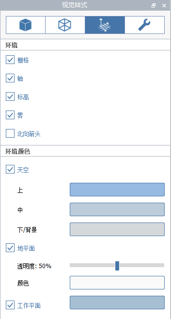

# Визуальные стили

Настраивайте визуальное представление модели, включая общее освещение, стили ребер и эффекты окружающей среды. Чтобы открыть панель «Визуальные стили» , щелкните значок солнцезащитных очков на панели палитр:

Визуальные стили[ можно задавать для каждой сцены по отдельности](https://windows.help.formit.autodesk.com/building-the-farnsworth-house/visual-settings), сохранять параметры любимого стиля и применять их к другим сценам.

## Поверхности

Управление отображением и тонированием поверхностей.

**Естественная яркость**: определяет общую яркость всех материалов сцены. При значении 100 материалы, на которые падает свет, будут отображаться с максимальной яркостью цвета или текстуры материала. При значении более 100 материалы будут чрезмерно контрастными, однако это может быть полезно для моделей SketchUp, которые в FormIt выглядят темными. По умолчанию используется значение 100.

**Контрастность рассеянного света**: определяет степень затемнения граней в тени по сравнению с гранями, находящимися под прямыми солнечными лучами. Значение 0 означает, что освещение не оказывает никакого влияния \(все материалы отображаются с максимальной яркостью независимо от ориентации\), тогда как при более высоких значениях грани в тени становятся темнее. Значение по умолчанию равно 25.

Переключите параметр **Тени**, чтобы посмотреть, как будет [тонироваться проект в текущее время суток](https://windows.help.formit.autodesk.com/tool-library/shadows).

**Интенсивность теней**: определяет отображение темных теней на нулевой плоскости и других гранях. Значение 0 делает тени практически невидимыми, а значение 100 — черными. Значение по умолчанию равно 20.

**Естественные тени**: слегка тонирует углы, чтобы придать реалистичность модели FormIt.

**Монотонные поверхности**: отключает цвет и текстуру всех материалов и делают окружающую среду белой. Этот режим полезен для расчета теней и тонирования.

В разделе «Цвета поверхности» задаются цвета по умолчанию для граней, к которым не применен материал.

**Грани**: цвет всех лицевых граней FormIt по умолчанию \(или цвет граней с обеих сторон, если снят флажок «Задние грани»\), к которым не применен материал.

**Задние грани**: используется для отображения различных материалов с обеих сторон одной грани для моделей SketchUp, импортированных в FormIt, в которых это необходимо. По умолчанию этот флажок снят, однако при открытии и импорте моделей SketchUp он устанавливается. В объектах геометрии, не относящихся к SketchUp, указанный цвет задней грани отображается на обратных сторонах граней.

Используйте инструкции разделов «Эффекты разреза сечения» и «Эффекты условного материала-отделки сечения» для управления цветами по умолчанию граней, прямых и эффекта условного материала-отделки при использовании инструмента [Секущая плоскость](section-planes.md).

## Нулевые плоскости

Если в режиме редактирования группы отключена нулевая плоскость, синяя сетка рабочей плоскости также отключается.

Цвет рабочей плоскости также можно настроить на панели «Визуальные стили».

## Ребра

Управление стилем отображения всех ребер модели.

**Контрастность**: позволяет настроить видимость всех ребер. Значение 0 делает ребра фактически невидимыми. Значение по умолчанию равно 60. 

**Цвет**: влияет на цвет всех ребер модели. По умолчанию используется черный цвет.

**Широкие ребра**: делает шире все ребра, включая ребра силуэта.

**Эскизные ребра**: добавляет ко всем ребрам эффект эскиза для имитации эффекта рисования от руки.

**Скрыть ребра**: отображает ребра, которые могут быть перекрыты поверхностями.

**Удлинить ребра**: удлиняет некоторые ребра для создания эффекта рисования от руки.

## Среда

Включение/отключение отображения эффектов среды и вспомогательных объектов.

**Сетка**: управляет отображением сетки на нулевой плоскости, а также сетки, отображаемой при редактировании группы. Если сетка отключена, параметр «Привязка к сетке» также отключается.

**Оси**: позволяет настраивать отображение осей XYZ в начале координат глобальной системы координат или в начале координат группы при редактировании группы.

**Уровни**: позволяет настраивать отображение [**уровней**](levels-and-area.md) ****, заданных на панели «Уровни».

**Туман**: позволяет настраивать отображение тумана, который создается для того, чтобы скрыть переход от нулевой плоскости к небу. Если параметр «Туман» отключен появляется четкая линия горизонта там, где нулевая плоскость \(если она включена\) соприкасается с небом.

**Направление на север**: позволяет настроить отображение небольшого графического элемента, который указывает направление условного севера \(в зависимости от местоположения и спутниковых снимков\).

Можно также настроить цвета среды, например, неба, фона и нулевой плоскости.

Небо состоит из градиента цветов **Нижний/Фоновый**, **Средний** и **Верхний**.

Если флажок **Небо** снят, отображаются только цвета **Нижний/Фоновый**.

## Диагностика

Включение/отключение отображения инструментов диагностики.

**Проблемы с непроницаемостью**: красным цветом выделяются все ребра, не являющиеся частью непроницаемого твердотельного объекта.

**Задние грани**: красным цветом выделяются все грани, обращенные не в ту сторону \(задние грани всех твердотельных объектов должны быть обращены внутрь твердотельной формы\).

[Дополнительные сведения об использовании диагностики «Непроницаемость» и «Задние грани» для выявления и устранения проблем с твердотельными моделями](https://formit.autodesk.com/blog/post/repairing-solid-models).

