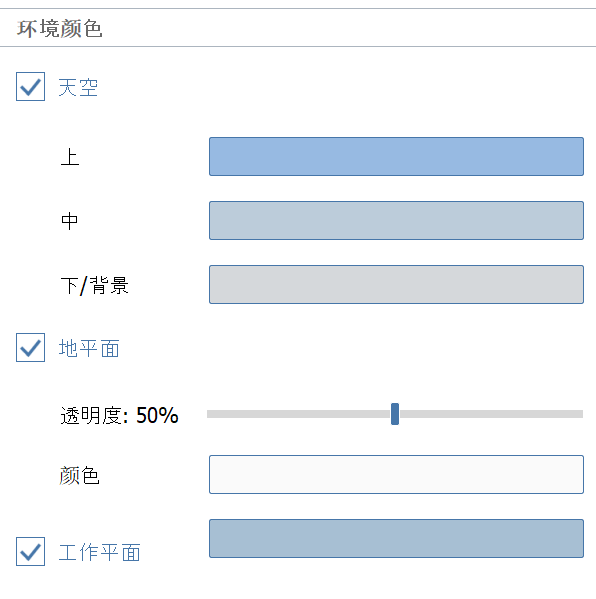
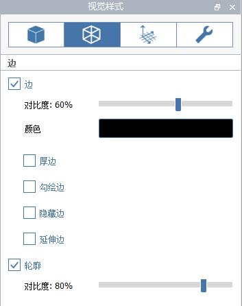
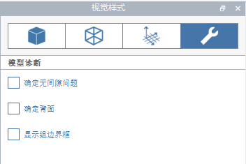

# Vizuální styly

Přizpůsobte si vizuální vzhled modelu, včetně celkového osvětlení, stylů hran a efektů prostředí. Panel Vizuální styly zobrazíte kliknutím na ikonu slunečních brýlí na panelu palet:

Vizuální styly [lze nastavit pro jednotlivé scény](https://windows.help.formit.autodesk.com/building-the-farnsworth-house/visual-settings), takže si můžete uložit oblíbená nastavení stylů a použít je pro další scény.

## Povrchy

Spravujte způsob zobrazení a stínování povrchů.

**Okolní jas** řídí celkový jas všech materiálů ve scéně. Hodnota 100 znamená, že materiály vystavené světlu se zobrazí v plném jasu definovaném v barvě nebo textuře materiálu. Při nastavení hodnot větších než 100 budou materiály přeexponované, ale toto nastavení může být užitečné u modelů aplikace SketchUp, které v aplikaci FormIt stále vypadají tmavě. Výchozí hodnota je 100.

**Okolní kontrast** určuje, o kolik tmavší se zobrazí plochy ve stínu ve srovnání s plochami vystavenými přímému slunečnímu světlu. Hodnota 0 znamená, že osvětlení nemá žádný vliv \(všechny materiály se zobrazí v plném jasu bez ohledu na orientaci\), zatímco vyšší hodnoty způsobí, že se plochy ve stínu budou jevit jako tmavší. Výchozí hodnota je 25.

Přepnutím možnosti **Stíny** zjistíte, jak by byl váš návrh [zastíněn v aktuální denní době](https://windows.help.formit.autodesk.com/tool-library/shadows).

**Intenzita stínu** určuje, jak moc tmavé stíny se vykreslí na základní rovině a dalších plochách. Při hodnotě 0 budou stíny neviditelné a při hodnotě 100 budou stíny černé. Výchozí hodnota je 20.

**Okolní stíny** přidají stínování do rohů, díky čemuž budou modely aplikace FormIt působit realističtěji.

Možnost **Monotónní povrchy** vypne barvu a texturu všech materiálů a okolní prostředí změní na bílé. Tato možnost je užitečná pro studie stínů nebo stínování.

Část Barvy povrchu definuje výchozí barvy ploch, pokud není použit žádný materiál.

Možnost **Plochy** určuje výchozí barvu všech čelních ploch modelů aplikace FormIt \(nebo obou stran, jestliže není zaškrtnuto políčko Zadní plochy\), pokud není použit žádný materiál.

Možnost **Zadní plochy** slouží k zobrazení různých materiálů na obou stranách jedné plochy u modelů aplikace SketchUp importovaných do aplikace FormIt, které to vyžadují. Tato možnost není ve výchozím nastavení zaškrtnuta, ale při otevření nebo importu modelů SketchUp je zaškrtnuta. V geometrii jiné než SketchUp se na zadních stranách ploch zobrazí zadaná barva zadní plochy.

V částech Efekty řezu a Efekty šrafování řezu můžete spravovat výchozí barvy ploch, čar a efektu šrafování při použití nástroje [Rovina řezu](section-planes.md).

## Základní roviny

Když je v režimu úprav skupiny vypnuta základní rovina, je nyní vypnuta také modrá osnova pracovní roviny.

Barvu pracovní roviny si také můžete přizpůsobit na panelu Vizuální styly.

## Hrany

Spravujte styl zobrazení všech hran v modelu.

**Kontrast** ovlivňuje viditelnost všech hran. Při hodnotě 0 budou hrany neviditelné. Výchozí hodnota je 60.

**Barva** ovlivňuje barvu všech hran v modelu. Výchozí barva je černá.

Možnost **Tlusté hrany** nastaví všechny hrany silnější, včetně hran siluet.

Možnost **Načrtnuté hrany** přidá ke všem hranám efekt náčrtu, který navozuje dojem ručního kreslení.

Možnost **Skryté hrany** zobrazí hrany, které jsou jinak zakryty povrchy.

Možnost **Prodloužené hrany** přidá k některým hranám prodloužení, které navozuje dojem ručního kreslení.

## Prostředí

V této části můžete přepínat zobrazení efektů prostředí a pomocných objektů.

**Osnova** řídí zobrazení osnovy na základní rovině a také osnovy zobrazené při úpravách skupiny. Pokud je osnova zakázána, bude zakázána také možnost Přichytit k osnově.

**Osy** řídí zobrazení os XYZ, které se zobrazí v počátku světa nebo v počátku skupiny, pokud upravujete skupinu.

Možnost **Podlaží** řídí zobrazení [**podlaží** ](levels-and-area.md)****na panelu Podlaží.

**Mlha** ovládá zobrazení mlhy, která je vykreslena tak, aby přechod mezi základní rovinou a oblohou vypadal plynule. Vypnutím mlhy se vytvoří tvrdá linie horizontu v místě, kde se základní rovina \(pokud je povolena\) setkává s oblohou.

Možnost **Směrová růžice** řídí zobrazení malé grafické pomůcky, která označuje směr severu projektu \(podle umístění a satelitního snímku\).

Přizpůsobit lze také barvy prostředí, jako je obloha, pozadí a základní rovina. 

Obloha se skládá z gradientu barev **Dolní/Pozadí**, **Střední** a **Horní**.

Pokud možnost **Obloha** není zaškrtnuta, bude viditelná pouze barva **Dolní/Pozadí**.

## Diagnostika

Zde můžete přepínat zobrazení diagnostických nástrojů.

Možnost **Problémy s vodotěsností** zvýrazní červeně všechny hrany, které nejsou součástí vodotěsného objektu tělesa.

**Zadní plochy** zvýrazní červeně všechny plochy, které směřují nesprávným směrem \(všechny objekty těles by měly mít zadní plochy obrácené směrem dovnitř tvaru tělesa\).

[Přečtěte si další informace o použití diagnostických nástrojů Problémy s vodotěsností a Zadní plochy k identifikaci a opravě problémů s modely těles](https://formit.autodesk.com/blog/post/repairing-solid-models).

