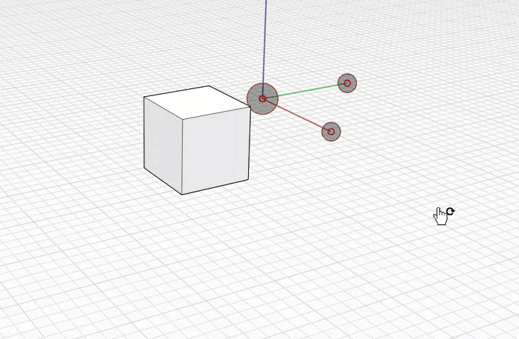

# Work Planes

When you change the world axes in the main sketch, or the local axes of a group, a work plane is associated with the X and Y axes. A **work plane** is a virtual 2-dimensional surface used as the default plane for sketching. This work plane will stretch out to infinity and provide a surface to sketch on without snapping to elements behind it.

To learn how you can edit the Ground Plane, see [Visual Styles.](../formit-primer/part-i/visual-settings.md)

## Changing Work Planes

Rotate the [World Axes](world-axes.md) to the plane of another object in the sketch. This will align the active work plane to correspond to this face. You can now sketch, place elements, and modify elements relative to the new XY plane, rather than the default ground plane. You can orbit behind or under the grid and work planes to snap and inference to elements behind it.

You can toggle the grid line's visibility on and off to benefit from work plane based sketching. You can control this setting in Visual Style &gt; Environment &gt; **Display Grid \(DG\).**

You can also control whether you snap to the grid when drawing. Toggle this setting on and off in Settings &gt; **Snap to Grid \(SG\).**

