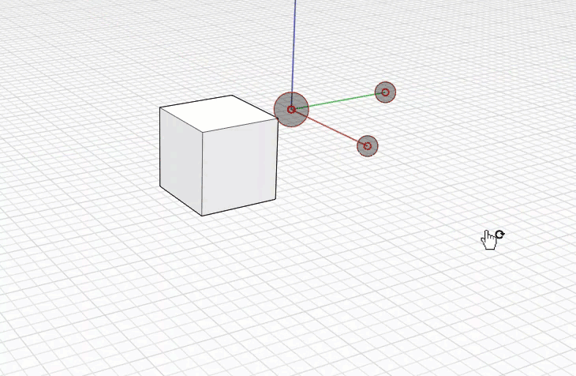

# Planos de trabajo

Cuando se cambian los ejes globales en el boceto principal o los ejes locales de un grupo, se asocia un plano de trabajo a los ejes X e Y. Un **plano de trabajo** es una superficie virtual bidimensional que se utiliza como plano por defecto para la creación de bocetos. Este plano de trabajo se estirará hasta el infinito y proporcionará una superficie para crear el boceto sin forzar el cursor a los elementos que se encuentran detrás de él.

Para obtener información sobre cómo editar el plano de suelo, consulte [Estilos visuales.](../formit-primer/part-i/visual-settings.md)

## Cambio de planos de trabajo

Rote los [ejes universales](world-axes.md) al plano de otro objeto en el boceto. De este modo, se alineará el plano de trabajo activo para que se corresponda con esta cara. Ahora puede crear bocetos, colocar elementos y modificar elementos en relación con el nuevo plano XY en lugar del plano de suelo por defecto. Puede orbitar detrás o debajo de la rejilla y los planos de trabajo para forzar el cursor y establecer deducciones a los elementos que están detrás.

Puede activar y desactivar la visibilidad de la línea de rejilla para beneficiarse de la creación de bocetos basados en planos de trabajo. Puede controlar este parámetro en Estilo visual &gt; Entorno &gt; **Mostrar rejilla \(DG\).**

También puede controlar si se fuerza el cursor a la rejilla al dibujar. Active y desactive este parámetro en Configuración &gt; **Forzar cursor a rejilla \(SG\).**

