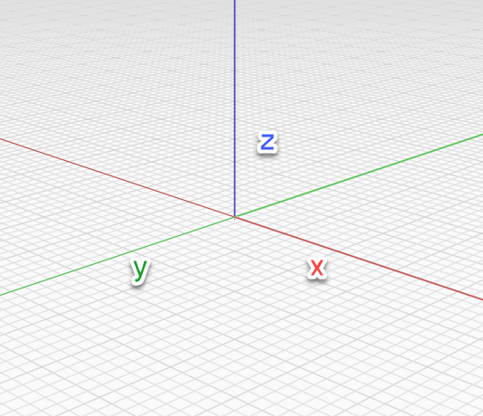
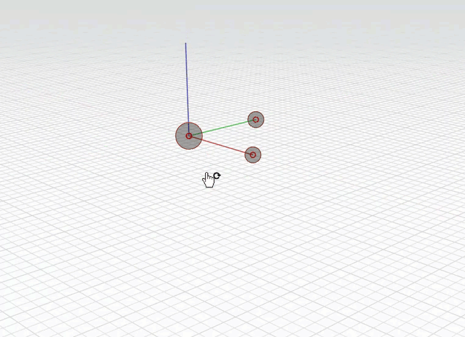

# Globální osy

Výchozí souřadnicový systém a osnovu lze upravit změnou globální osy.

## Kreslení a modelování pomocí os

Když je v aplikaci FormIt otevřen prázdný náčrt, zobrazí se ve středu obrazovky globální osy jako tři čáry (červená, zelená a modrá). Tyto tři čáry definují tři kartézské směry, které definují 3D svět. Směr X je definován červenou čárou, směr Y zelenou čárou a směr Z (neboli nahoru) modrou čárou.

Chcete-li osnovu otočit a znovu definovat počáteční bod náčrtu, **klikněte pravým tlačítkem** na prázdné místo ve scéně a v místní nabídce vyberte ikonu **Nastavit osy \(SZ\)**.   .

Zobrazí se pomůcka Nastavit osy. Kliknutím na velký uzel uprostřed pomůcku vyberte. Dalším kliknutím nastavte bod počátku. Nyní kliknutím na tečku na červené ose otočte osnovu nebo kliknutím na tečku na modré ose vertikálně otočte rovinu osnovy. Kliknutím do prostoru potvrďte změnu.  

Chcete-li **obnovit** výchozí nastavení počátku a osnovy, klikněte pravým tlačítkem myši na prázdné místo ve scéně a vyberte možnost **Obnovit osy \(RZ\)**.

## Globální osy a místní osy

Výše uvedený postup vysvětluje, jak řídit **globální souřadnicový systém** náčrtu. Když začnete pracovat se [**skupinami**](groups.md), můžete řídit **místní souřadnicový systém** této skupiny jedinečně z celkového náčrtu. Při úpravách skupiny můžete upravovat místní souřadnicový systém podle stejných kroků jako výše – tyto změny se však budou týkat pouze dané skupiny.

## Interakce s osami

* Při práci s nástroji náčrtu se zobrazí **červené, zelené a modré osy**, které slouží jako vodítko pro 3D kreslení. 
* **Fialová osa** zobrazuje kolmou a rovnoběžnou osu vzhledem k čarám nakresleným pod úhlem.
* Podržením **klávesy Shift** při kreslení nebo posouvání se **uzamkne aktuální osa**.

