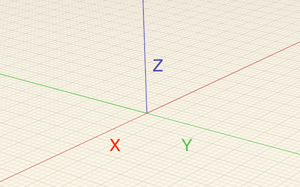
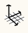

### World Axes

---
> The default coordinate system and grid can be modified by changing the world axis.

---

#### Understanding Drawing and Modeling Axes

When a blank sketch is opened in FormIt 360, the World Axes are displayed as three red, green and blue lines in the center of the screen. These three lines, define the three Cartesian directions that define the 3D world. The "X" direction is defined by the red line, the "Y" direction by the green line and the "Z" or "up" direction by the blue line.

To rotate the grid, right click on empty space in the scene and choose from the context menu. Drag on the red dot to move the origin and either blue dot to rotate the axes

To reset the coordinate system and grid back to the default setting, right click on empty space in the scene and choose 
.

* The **red, green and blue axes** display to allow you to sketch in 3D without leaving the tool.

* The **purple axis** displays an axis relative to the lines you are currently drawing.

* Hold down the **Shift key** while dragging a line segment to **lock to the current axis**.
