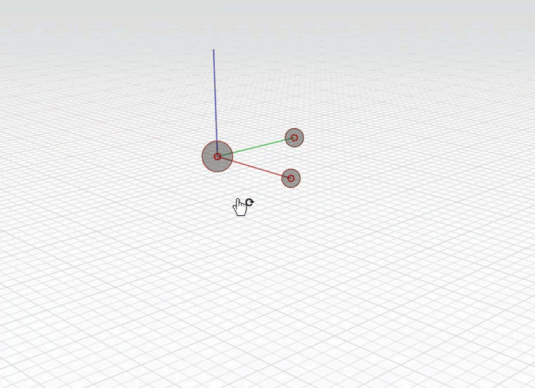

# Axes universels

Le système de coordonnées et la grille par défaut peuvent être modifiés en changeant l’axe universel.

## Dessin et modélisation avec des axes

Lorsqu’une esquisse vide est ouverte dans FormIt, les axes universels sont représentés par trois lignes rouges, vertes et bleues au centre de l’écran. Ces trois lignes définissent les trois directions cartésiennes qui définissent le monde 3D. La direction « X » est définie par la ligne rouge, la direction « Y » par la ligne verte et la direction « Z » ou « haut » par la ligne bleue.

Pour faire pivoter la grille et redéfinir le point d’origine de l’esquisse, **cliquez avec le bouton droit de la souris** sur un espace vide de la scène, puis choisissez l’icône **Définir les axes \(SZ\)** dans le menu contextuel  .

Le widget Définir les axes s’affiche. Cliquez sur la grande poignée au centre pour sélectionner le widget. Cliquez à nouveau pour définir le point d’origine. Cliquez sur le point de l’axe rouge pour faire pivoter la grille ou cliquez sur le point des axes bleus pour faire pivoter le plan de grille verticalement. Cliquez dans l’espace pour confirmer la modification  .

Pour **rétablir** les paramètres par défaut de l’origine et de la grille, cliquez avec le bouton droit de la souris sur un espace vide de la scène et choisissez **Réinitialiser les axes \(RZ\)**.

## Axes universels et axes locaux

Les étapes ci-dessus expliquent comment contrôler le **système de coordonnées universelles** de votre esquisse. Lorsque vous commencez à travailler avec des [**groupes**](groups.md), vous pouvez contrôler le **système de coordonnées local** de ce groupe de manière unique à partir de l’esquisse globale. Lorsque vous modifiez un groupe, vous pouvez modifier le système de coordonnées local en suivant la même procédure que ci-dessus, mais ces modifications s’appliquent uniquement au groupe.

## Interactions avec les axes

* Les **axes rouge, vert et bleu** s’affichent lorsque vous utilisez les outils d’esquisse pour guider votre esquisse 3D.
* L’**axe violet** affiche un axe perpendiculaire et un axe parallèle par rapport aux lignes dessinées à un angle.
* Maintenez la touche **Maj** enfoncée pendant que vous effectuez une esquisse ou déplacez le curseur pour **verrouiller sur l’axe actuel**.

